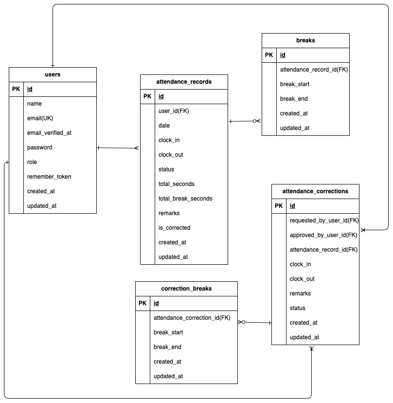

# coachtechフリマ

## 環境構築
**Dockerビルド**\
1.`git clone git@github.com:shino-ym/kintai-list.git`\
2.DockerDesktopアプリを立ち上げる\
3.`docker-compose up -d --build`

**Laravel環境構築**\
1. PHPコンテナ内に入る\
`docker-compose exec php bash`
2. 依存パッケージをインストール\
`composer install`
3. .env.exampleをコピーして.envを作る\
`cp .env.example .env`
4. vscode「.env」に以下の環境変数を追加
```
DB_CONNECTION=mysql
DB_HOST=mysql
DB_PORT=3306
DB_DATABASE=laravel_db
DB_USERNAME=laravel_user
DB_PASSWORD=laravel_pass
```
5. アプリケーションキーの作成\
`php artisan key:generate`
6. マイグレーションの実行\
`php artisan migrate`
7. シーディングの実行\
`php artisan db:seed`
> アクセスした場合に権限エラーが発生した場合は php コンテナから脱出し、コマンドライン上で以下を実行\
> `sudo chmod -R 777 src/storage`
>
> 上のコマンドで全データが動かない場合は、以下を実行。ただし権限が強すぎるので使用時は注意をしてください\
> `sudo chmod -R 777 src/*`

8. シーディングの実行(もしも上記 chmod -R 777 を実行した場合は docker-compose exec php bash で php コンテナ内に入ってください)\
`php artisan db:seed`

## MailHog 設定

env に以下を修正\

```
MAIL_MAILER=smtp
MAIL_HOST=mailhog
MAIL_PORT=1025
MAIL_USERNAME=null
MAIL_PASSWORD=null
MAIL_ENCRYPTION=null
MAIL_FROM_ADDRESS=test@test.com
MAIL_FROM_NAME="${APP_NAME}"
```

## PHPUnit テスト

1. テスト用データベース作成。PHPコンテナ内から脱出し、コマンドラインにて以下を実行。

`docker-compose exec mysql bash`

`mysql -u root -p`

password の文字が出たら\
`root`

2. テスト用のデータベース(demo_test)を作成するために以下を実行\
`CREATE DATABASE demo_test;`

3. データベースが作成されたか確認\
`SHOW DATABASES;`

4. exit にて MySQL コンテナから退出

5. vscode の「.env.testing」ファイルの APP_ENV と APP_KEY を以下に変更

```
APP_ENV=test
APP_KEY=
```

6. PHPコンテナ内に入る\
`docker-compose exec php bash`

7. アプリケーションキーを作成\
`php artisan key:generate --env=testing`

8. キャッシュ削除\
`php artisan config:clear`

9. マイグレーション実行\
`php artisan migrate --env=testing`

10. 全てのテスト項目を一気にテストするために、以下を実行\
`php artisan test`

## URL

- 開発環境： 一般ユーザーログイン画面 http://localhost/login
         : 管理者ログイン画面 http://localhost/admin/login
- phpMyAdmin:：http://localhost:8080/

## ユーザー情報

- 管理者：email(admin@a.com),password(12345678)

一般ユーザーは今回は5つのテストユーザーを作成している(コーチ許可あり)
- 一般ユーザー 1: email(user1@a.com),password(12345678)
- 一般ユーザー 2: email(user2@a.com),password(12345678)
- 一般ユーザー 3: email(user3@a.com),password(12345678)
- 一般ユーザー 4: email(user4@a.com),password(12345678)
- 一般ユーザー 5: email(user5@a.com),password(12345678)

## 変更仕様（以下全てコーチの許可あり）
<一般ユーザー画面>
- 会員登録のメールアドレスのバリデーションエラーにメール形式を追加。
- 勤怠情報がない日のレコード修正時の出勤退勤時間未記入時：出勤時間または退勤時間が不適切な値です というエラーメッセージが出る
- 勤怠詳細画面で修正を行なっても、管理者に承認されないと勤務一覧画面には反映されない
- 管理者に承認された後は、同じ日の修正申請ができる。（承認→修正→承認→修正と何度でも可能）
- ダミーの勤怠レコードは今月と先月分を作成

<管理者画面>
- 勤怠情報がない日のレコード修正時の出勤退勤時間未記入時：出勤時間または退勤時間が不適切な値です というエラーメッセージが出る
- 管理者が一般ユーザーの勤務修正をする場合は、何度でも修正可能。
- 一般ユーザーが修正申請したものは、管理者が承認すると、管理者も同じ日付のレコードが修正可能となる。
- CSVの表は、休憩を「休憩時間」、合計欄を「勤務合計時間」と表示

<テストケース>
- テスト要件の部分のバリデーションメッセージに関しては機能要件参照

## 使用技術

- PHP 8.1.33
- laravel 8.83.8
- MySQL 8.0.36

### 認証

Laravel Fortify\
ユーザー登録・ログイン・ログアウト機能を提供

### メール認証機能

MailHog\
開発環境でのメール送信内容の確認に使用

### テスト

PHPUnit\
機能テスト・結合テストでアプリ全体の動作を確認

## ER 図



## 補足

MailHog は http://localhost:8025 で確認可能。


